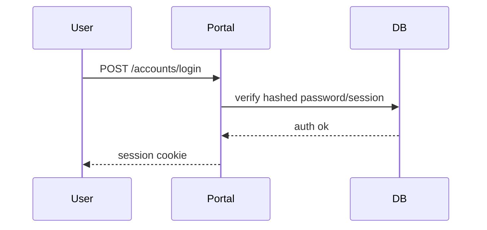
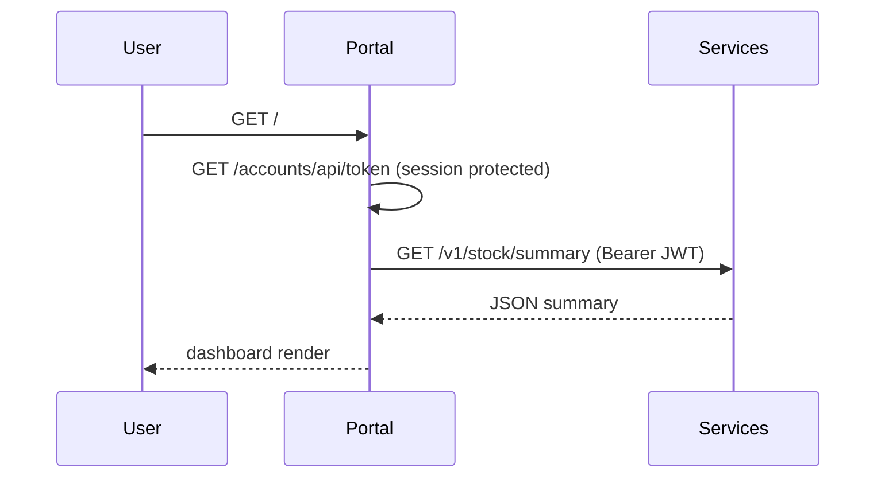
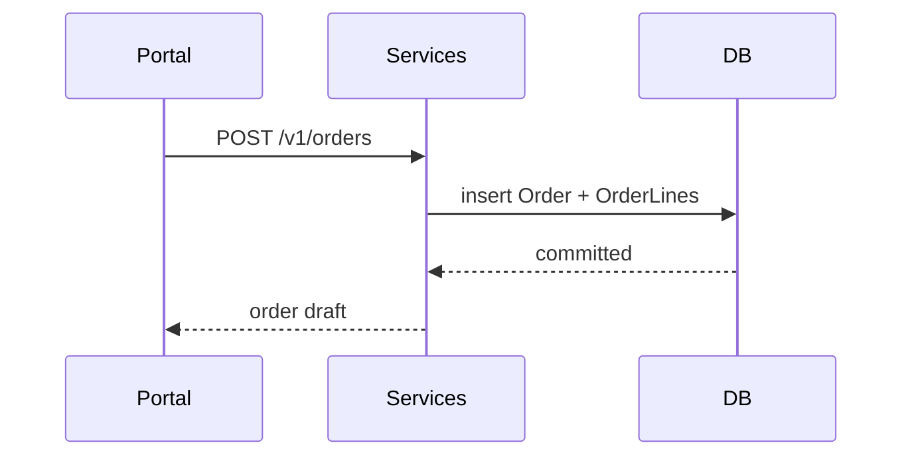
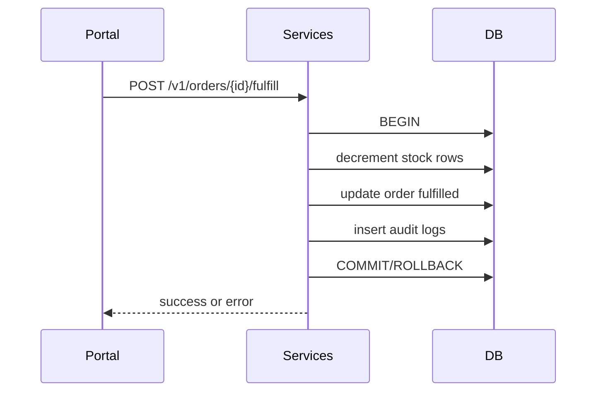

# ARCHITECTURE: Hybrid Django + FastAPI Inventory Platform

## 1) System Overview and Goals
This monorepo delivers a production-style hybrid architecture for multi-branch inventory and order management:
- **Django Portal** for humans (login, admin, dashboard).
- **FastAPI Services** for high-performance domain APIs.
- **Shared PostgreSQL** with ownership boundaries.
- **RBAC + Auditability + Privacy-first logging**.

## 2) High-level Architecture Diagram
```mermaid
flowchart LR
  U1[Branch User / Manager / Auditor] -->|TLS over WAN/VPN/SD-WAN| RP[Reverse Proxy / Ingress]
  U2[Remote Admin] -->|Zero Trust policy + MFA at edge| RP
  RP --> DJ[Django Portal\n(accounts, dashboard, admin)]
  RP --> FA[FastAPI Services\n(inventory, orders, stock)]
  DJ -->|internal service call + JWT| FA
  DJ --> PG[(PostgreSQL)]
  FA --> PG
  DJ --> LOG[Structured logs + Request ID]
  FA --> LOG
  DJ --> MON[Health checks]
  FA --> MON
```

## 3) Component Breakdown
| Component | Modules | Responsibility |
|---|---|---|
| Portal (Django) | `accounts`, `dashboard`, `core` | Session auth, role management, admin panel, UI, token issuance |
| Services (FastAPI) | `api`, `services`, `db`, `models`, `schemas` | Domain logic: branches, items, stock, orders, fulfillment, audit |
| Data | PostgreSQL | Shared DB with service-owned tables (`services_*`) and Django auth/admin tables |

## 4) Data Flows
### Login Flow (Portal)


### Portal obtains token and calls FastAPI


### Create Order Flow


### Fulfill Order Flow (transaction + audit)


## 5) WAN Considerations
- Multi-branch traffic model assumes VPN/SD-WAN overlays to data center ingress.
- End-to-end TLS required from branch clients to ingress.
- Zero-trust style segmentation: portal/admin and API paths separated, role-restricted.
- Latency handling: Portal->FastAPI uses timeout + retry env controls.
- Optional offline strategy: local branch cache with eventual sync (future roadmap).

## 6) Data Center / Infrastructure Plan
- **Current baseline:** Docker Compose single-node stack (dev/staging).
- **Scalable path:** split into multi-node deployment (Kubernetes/Swarm).
- **Backups:** nightly logical dump + WAL archival; quarterly restore drills.
- **HA/Replication:** PostgreSQL primary/replica with failover manager.
- **Monitoring:** health/readiness endpoints, centralized JSON logs, alerting on API errors and DB lag.

## 7) Security & Ethics
- RBAC enforced through JWT claims and Django groups.
- Audit trail for stock adjustments + order fulfillment.
- Privacy principles:
  - data minimization (only operational attributes)
  - safe logging (no secrets/passwords/tokens)
  - least privilege role boundaries
- CORS restricted to trusted origins.
- Secrets managed through env vars / secret stores in production.

### Threat model summary
| Threat | Mitigation |
|---|---|
| JWT forgery | Secret-based signature verification + expiry |
| Privilege abuse | Role checks + audit logs |
| Data leakage | Structured logs + redaction policy |
| WAN interception | TLS + VPN/SD-WAN |
| Service outage | health checks + retry/backoff |

## 8) How this satisfies the assignment
- **WAN Networks:** branch-to-core connectivity with VPN/SD-WAN and TLS; segmentation model documented.
- **Network Programming:** REST APIs, async-ready FastAPI, retries/timeouts and health contract.
- **Infrastructure:** Docker Compose, env-based config, health checks, internal DNS service names.
- **Data Center:** topology, backup/restore, HA replication options, observability strategy.
- **Ethics:** RBAC, auditability, privacy-by-design, safe logs, threat model.

## 9) Differentiators vs spreadsheet/basic inventory apps
- Transactional fulfill operation preventing inconsistent stock.
- Role-aware APIs and immutable audit logs.
- Clear service boundaries enable scale and independent evolution.
- WAN-aware resiliency and production deployment path.

## 10) Roadmap / Future Work
- Event bus for asynchronous fulfillment workflows.
- Rate limiting and abuse prevention.
- OpenTelemetry traces and Prometheus metrics.
- Multi-tenant branch federation + SSO/MFA.
- Offline-first branch sync module.
