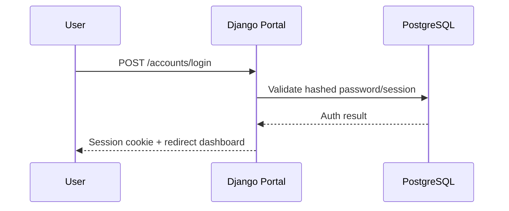
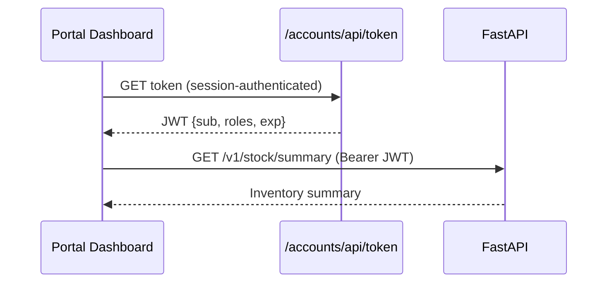
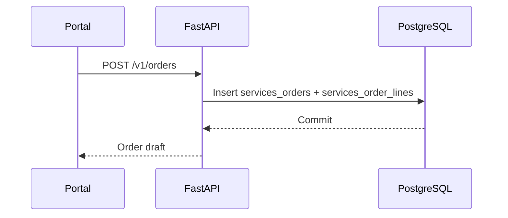
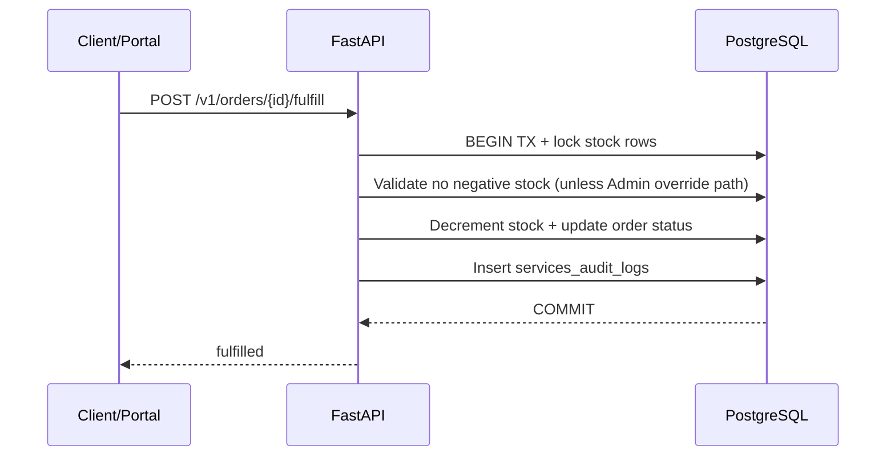

# ARCHITECTURE — Hybrid Django + FastAPI Inventory Platform

## 1) System overview and goals
This monorepo implements a hybrid architecture for multi-branch inventory and order management:
- **Django Portal**: human-facing login, role administration, dashboard UI, and JWT issuing endpoint.
- **FastAPI Services**: async-ready domain APIs for branches, items, stock, orders, and audit logs.
- **PostgreSQL**: shared DB with clear table ownership (`django_*` and `services_*`).

Goal: combine strong enterprise admin ergonomics (Django) with high-performance API execution (FastAPI).

## 2) High-level architecture diagram
```mermaid
flowchart LR
  BU[Branch Users\nManager/Worker/Admin/Auditor] -->|HTTPS over WAN / VPN / SD-WAN| RP[Reverse Proxy (Nginx optional)]
  RP --> DP[Django Portal\nAuth + Admin + Dashboard]
  DP -->|JWT issue + internal API calls| FS[FastAPI Services\nInventory/Orders/Stock]
  DP --> DB[(PostgreSQL)]
  FS --> DB
  DP --> OBS[Structured Logs + Health checks]
  FS --> OBS
```

## 3) Component breakdown

### Portal modules
- `accounts`: login/logout and JWT issuance (`/accounts/api/token/`) from Django group roles.
- `dashboard`: minimal inventory/order overview pages and graceful outage handling.
- `admin`: Django admin for users, groups, and `BranchDirectory`.

### Services modules
- `api/v1/routes`: REST boundaries for branches/items/stock/orders/audit.
- `services`: business logic (audit write helper, seed utility).
- `db` + `models`: SQLAlchemy session, metadata, and domain entities.
- `migrations`: Alembic migration path for `services_*` domain tables.

## 4) Data flows

### Login flow (Portal)


### Portal obtains token and calls FastAPI


### Create order flow


### Fulfill order flow (transaction + audit)


## 5) WAN considerations
- Branch connectivity model: users connect through HTTPS over VPN/SD-WAN overlay.
- Segmentation/zero-trust: only reverse proxy and app ports exposed; DB private to service network.
- Timeouts/retries: dashboard uses short timeout + retry for service calls to absorb WAN jitter.
- Optional offline strategy: local branch queue for order intents to replay when WAN returns (roadmap).

## 6) Data center / infrastructure plan
- **Single-node (lab/class)**: one Docker host running compose stack.
- **Multi-node (production)**: split web/API/DB nodes, managed Postgres, edge reverse proxy.
- **Backups**: nightly pg_dump + WAL archiving, tested restore runbooks.
- **Replication/HA**: Postgres streaming replication + failover manager.
- **Monitoring**: `/health` and `/ready` probes, structured logs shipped to central aggregator.

## 7) Security & ethics
- RBAC from Django groups embedded into JWT claims and enforced by FastAPI role dependencies.
- Auditability: stock adjustments and order fulfillment generate immutable audit rows.
- Privacy/data minimization: only required identity claims (`sub`, `username`, roles) in JWT; no secrets logged.
- Safe logging: structured JSON style, avoid password/token emission.

### Threat model summary
| Threat | Mitigation |
|---|---|
| Token interception | TLS + short token expiry + no token logging |
| Unauthorized writes | Role-based endpoint guards |
| Data tampering | Transactional updates + audit logs |
| Downtime | Health probes + retries + horizontal scale roadmap |

## 8) How this satisfies the assignment
- **WAN Networks**: VPN/SD-WAN concept, TLS transport, segmentation guidance, branch connectivity model.
- **Network Programming**: REST client/server boundaries, async-ready FastAPI, retry/timeout behavior.
- **Infrastructure**: Docker Compose deployment, env-based config, reverse proxy option.
- **Data Center**: topology options, backup/restore, replication and monitoring strategies.
- **Ethics**: privacy-by-minimization, RBAC, auditability, safe logging practices.

## 9) Differentiators vs spreadsheets/basic apps
- Centralized RBAC + audited stock moves (not available in spreadsheets).
- Atomic fulfillment prevents race conditions and inventory drift.
- Hybrid architecture scales API workloads independently from UI/admin workloads.

## 10) Roadmap / future work
- Add Redis-backed background jobs + webhook outbox.
- Add Prometheus metrics + OpenTelemetry traces.
- Add branch-scoped policy engine and fine-grained ABAC.
- Add DR drills, multi-region read replicas, and offline sync agent.
